# Ride Hail Duration Model

## Background

Given training data on trip locations and durations we would like to estimate travel times between two specified locations at a given departure time. Quality of solution would be assessed using mean absolute error of predicted versus actual durations.

## Approach

### Unzipping

Files were downloaded from the Dropbox link provided and unzipped using:  
`$bzip2 -dk test.csv.bz2`  
`$bzip2 -dk train.csv.bz2`


## Exploration

Questions for exploration:
1. How many unique journeys?
2. How many repeat journeys?
3. Average duration?
4. Average distance?
5. In what geography are most journeys occuring?
6. Is there any user data that can be extracted?


```python
print('Unique journeys', df_train.shape[0])
print('Average Duration', np.mean(df_train['duration']), 'secs')
```

    Unique journeys 12905715
    Average Duration 842.141952538 secs


### Mapping

We will plot a sample of 100,000 points to get an overview of the data we are looking at. It looks like the data set is for trips around New York City.


```python
if rerun_analysis_flag == 1:
    P = df_train.sample(100000, replace=False, random_state=seed).plot(kind='scatter', x='start_lng', 
                                                                     y='start_lat',color='white'
                                                                     , alpha=.6, s=1,
                                                                    xlim=(-74.04,-73.77),ylim=(40.61, 40.91))
    P.set_facecolor('black') #Background Color
```


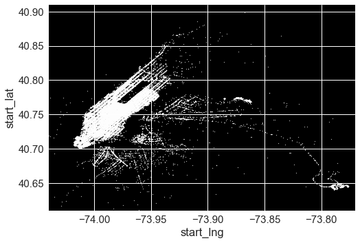


### Distribution of Duration


```python
# Distribution of Duration Seconds
if rerun_analysis_flag == 1:
    sns.distplot(df_train['duration'], fit=norm);
    fig = plt.figure()
    res = stats.probplot(df_train['duration'], plot=plt)
```


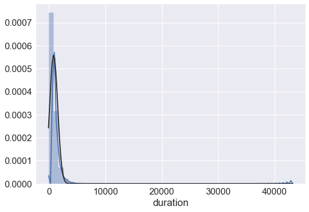


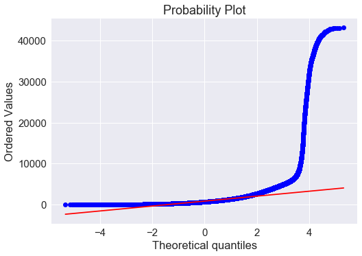


Here we can see there are some serious outliers in the travel time duration which could affect the model. We will remove these.

Also, we can see from the probability plot that the duration seconds are not normally distributed as the blue points do not follow the red line, so we will apply a log transform to correct for this.

5000 secs is roughly 1hr 23min, so we will remove records with a time greater than this duration. 
In reality a ride must be greater than 0 sec and we can see there are some rides of 0secs in the data. 
A reasonable minimum time for a ride is around 1min. So we will remove any rides less than 60sec.


```python
# Remove records with Duration > 5000 seconds
df_train = df_train.loc[ (df_train['duration'] >= 60) & (df_train['duration'] <= 5000) ]
```


```python
# Check the distribution
# Boxplot
if rerun_analysis_flag == 1:
    f, ax = plt.subplots(figsize=(8, 6))
    fig = sns.boxplot( data=df_train['duration'])
```


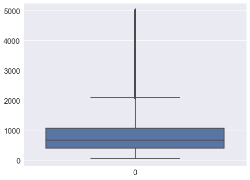


```python
# Check the distribution after removing records with duration > 5000 sec
# Distribution of Duration Seconds
if rerun_analysis_flag == 1:
    sns.distplot(df_train['duration'], fit=norm);
    fig = plt.figure()
    res = stats.probplot(df_train['duration'], plot=plt)
```


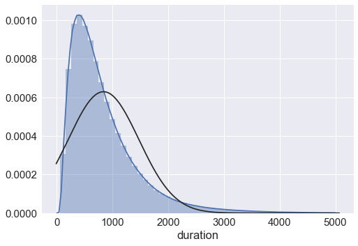


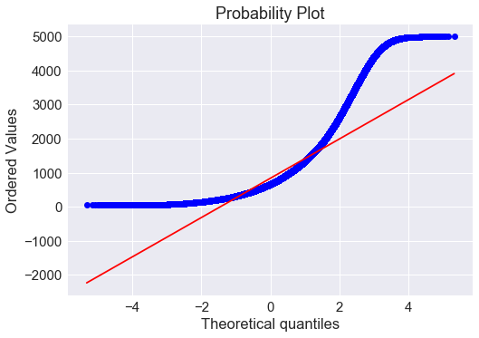


```python
#skewness and kurtosis
print("Skewness: %f" % df_train['duration'].skew())
print("Kurtosis: %f" % df_train['duration'].kurt())
```

    Skewness: 1.971872
    Kurtosis: 5.575568


It is clear from the histogram of duration that the data has a positive skew and that it is not normally distributed (the black line is the normal distribution).


```python
# Apply the log and plot
if rerun_analysis_flag == 1:
    #df_train['duration'] = np.log(df_train['duration'])
    sns.distplot(df_train['duration'], fit=norm);
    fig = plt.figure()
    res = stats.probplot(df_train['duration'], plot=plt)
```


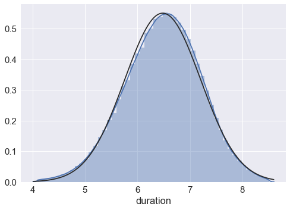


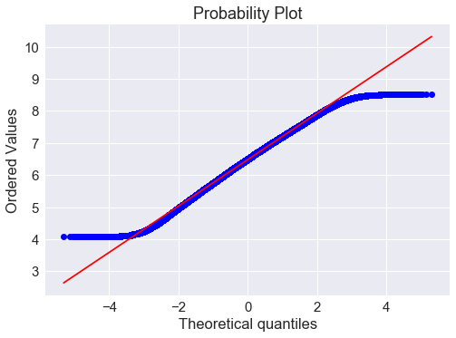


Now duration is approximately normally distributed as can be seen in the histogram and the probability plot where the blue points are now following the red line.

### Missing Data??
Is there any missing data in any of the columns?
If so, we will have to address it, by either removing it or imputing it.


```python
if rerun_analysis_flag == 1:
    print('Missing rows in duration' , len(df_train.loc[df_train['duration'].isnull()]) )
    print('Missing rows in start_lng' , len(df_train.loc[df_train['start_lng'].isnull()]) )
    print('Missing rows in start_lat' , len(df_train.loc[df_train['start_lat'].isnull()]) )
    print('Missing rows in end_lng' , len(df_train.loc[df_train['end_lng'].isnull()]) )
    print('Missing rows in end_lat' , len(df_train.loc[df_train['end_lat'].isnull()]) )
    print('Missing rows in start_timestamp' , len(df_train.loc[df_train['start_timestamp'].isnull()]) )

```

    Missing rows in duration 0
    Missing rows in start_lng 0
    Missing rows in start_lat 0
    Missing rows in end_lng 0
    Missing rows in end_lat 0
    Missing rows in start_timestamp 0


There is no missing data in any of the columns, this means we don't need to remove records or perform any imputation on the data.

Lets take a look at the high level summary statistics of the data frame now....


```python
if rerun_analysis_flag == 1:
    df_train.describe()
```


<div>
<table border="1" class="dataframe">
  <thead>
    <tr style="text-align: right;">
      <th></th>
      <th>row_id</th>
      <th>start_lng</th>
      <th>start_lat</th>
      <th>end_lng</th>
      <th>end_lat</th>
      <th>start_timestamp</th>
      <th>duration</th>
    </tr>
  </thead>
  <tbody>
    <tr>
      <th>count</th>
      <td>1.281595e+07</td>
      <td>1.281595e+07</td>
      <td>1.281595e+07</td>
      <td>1.281595e+07</td>
      <td>1.281595e+07</td>
      <td>1.281595e+07</td>
      <td>1.281595e+07</td>
    </tr>
    <tr>
      <th>mean</th>
      <td>6.451047e+06</td>
      <td>-7.397404e+01</td>
      <td>4.075075e+01</td>
      <td>-7.397374e+01</td>
      <td>4.075149e+01</td>
      <td>1.435376e+09</td>
      <td>6.480795e+00</td>
    </tr>
    <tr>
      <th>std</th>
      <td>3.725654e+06</td>
      <td>3.735954e-02</td>
      <td>2.762920e-02</td>
      <td>3.527811e-02</td>
      <td>3.172831e-02</td>
      <td>9.079665e+06</td>
      <td>7.237966e-01</td>
    </tr>
    <tr>
      <th>min</th>
      <td>0.000000e+00</td>
      <td>-7.450384e+01</td>
      <td>4.036892e+01</td>
      <td>-7.451682e+01</td>
      <td>4.036887e+01</td>
      <td>1.420099e+09</td>
      <td>4.094345e+00</td>
    </tr>
    <tr>
      <th>25%</th>
      <td>3.224157e+06</td>
      <td>-7.399207e+01</td>
      <td>4.073705e+01</td>
      <td>-7.399143e+01</td>
      <td>4.073561e+01</td>
      <td>1.427506e+09</td>
      <td>6.001415e+00</td>
    </tr>
    <tr>
      <th>50%</th>
      <td>6.450720e+06</td>
      <td>-7.398198e+01</td>
      <td>4.075363e+01</td>
      <td>-7.398011e+01</td>
      <td>4.075411e+01</td>
      <td>1.434865e+09</td>
      <td>6.504288e+00</td>
    </tr>
    <tr>
      <th>75%</th>
      <td>9.676998e+06</td>
      <td>-7.396783e+01</td>
      <td>4.076794e+01</td>
      <td>-7.396360e+01</td>
      <td>4.076908e+01</td>
      <td>1.443338e+09</td>
      <td>6.982863e+00</td>
    </tr>
    <tr>
      <th>max</th>
      <td>1.290571e+07</td>
      <td>-7.341617e+01</td>
      <td>4.103082e+01</td>
      <td>-7.341435e+01</td>
      <td>4.103151e+01</td>
      <td>1.451635e+09</td>
      <td>8.517193e+00</td>
    </tr>
  </tbody>
</table>
</div>


What about the missing values in the test set?


```python
df_test.isnull().sum()
```


    row_id             0
    start_lng          0
    start_lat          0
    end_lng            0
    end_lat            0
    start_timestamp    0
    dtype: int64


No missing values in test data.


```python
# Lets look at some summary stats
if rerun_analysis_flag == 1:
    df_test.describe()
```


<div>
<table border="1" class="dataframe">
  <thead>
    <tr style="text-align: right;">
      <th></th>
      <th>row_id</th>
      <th>start_lng</th>
      <th>start_lat</th>
      <th>end_lng</th>
      <th>end_lat</th>
      <th>start_timestamp</th>
    </tr>
  </thead>
  <tbody>
    <tr>
      <th>count</th>
      <td>1.434344e+06</td>
      <td>1.434344e+06</td>
      <td>1.434344e+06</td>
      <td>1.434344e+06</td>
      <td>1.434344e+06</td>
      <td>1.434344e+06</td>
    </tr>
    <tr>
      <th>mean</th>
      <td>7.171715e+05</td>
      <td>-7.397387e+01</td>
      <td>4.075066e+01</td>
      <td>-7.397361e+01</td>
      <td>4.075142e+01</td>
      <td>1.435379e+09</td>
    </tr>
    <tr>
      <th>std</th>
      <td>4.140596e+05</td>
      <td>3.790497e-02</td>
      <td>2.786509e-02</td>
      <td>3.579871e-02</td>
      <td>3.188187e-02</td>
      <td>9.079442e+06</td>
    </tr>
    <tr>
      <th>min</th>
      <td>0.000000e+00</td>
      <td>-7.447762e+01</td>
      <td>4.038432e+01</td>
      <td>-7.447762e+01</td>
      <td>4.038572e+01</td>
      <td>1.420099e+09</td>
    </tr>
    <tr>
      <th>25%</th>
      <td>3.585858e+05</td>
      <td>-7.399208e+01</td>
      <td>4.073701e+01</td>
      <td>-7.399143e+01</td>
      <td>4.073548e+01</td>
      <td>1.427508e+09</td>
    </tr>
    <tr>
      <th>50%</th>
      <td>7.171715e+05</td>
      <td>-7.398196e+01</td>
      <td>4.075357e+01</td>
      <td>-7.398009e+01</td>
      <td>4.075407e+01</td>
      <td>1.434866e+09</td>
    </tr>
    <tr>
      <th>75%</th>
      <td>1.075757e+06</td>
      <td>-7.396774e+01</td>
      <td>4.076793e+01</td>
      <td>-7.396354e+01</td>
      <td>4.076904e+01</td>
      <td>1.443343e+09</td>
    </tr>
    <tr>
      <th>max</th>
      <td>1.434343e+06</td>
      <td>-7.342264e+01</td>
      <td>4.102990e+01</td>
      <td>-7.341788e+01</td>
      <td>4.103128e+01</td>
      <td>1.451635e+09</td>
    </tr>
  </tbody>
</table>
</div>


#### How many of each location are there?


```python
# Intuition
# select start_lng_rd, count(*) from table group by start_lng_rd order by count(*) desc
a = df_train[['start_lng_rnd', 'start_lat_rnd']]
a['location'] = df_train.start_lng_rnd.map(str) + " " + df_train.start_lat_rnd.map(str)
a.head()
```

    /Users/andrew/miniconda2/envs/keras/lib/python3.5/site-packages/ipykernel/__main__.py:4: SettingWithCopyWarning: 
    A value is trying to be set on a copy of a slice from a DataFrame.
    Try using .loc[row_indexer,col_indexer] = value instead
    
    See the caveats in the documentation: http://pandas.pydata.org/pandas-docs/stable/indexing.html#indexing-view-versus-copy


<div>
<table border="1" class="dataframe">
  <thead>
    <tr style="text-align: right;">
      <th></th>
      <th>start_lng_rnd</th>
      <th>start_lat_rnd</th>
      <th>location</th>
    </tr>
  </thead>
  <tbody>
    <tr>
      <th>0</th>
      <td>-74.009</td>
      <td>40.714</td>
      <td>-74.009 40.714</td>
    </tr>
    <tr>
      <th>1</th>
      <td>-73.971</td>
      <td>40.762</td>
      <td>-73.971 40.762</td>
    </tr>
    <tr>
      <th>2</th>
      <td>-73.995</td>
      <td>40.745</td>
      <td>-73.995 40.745</td>
    </tr>
    <tr>
      <th>3</th>
      <td>-73.991</td>
      <td>40.750</td>
      <td>-73.991 40.75</td>
    </tr>
    <tr>
      <th>4</th>
      <td>-73.946</td>
      <td>40.774</td>
      <td>-73.946 40.774</td>
    </tr>
  </tbody>
</table>
</div>


```python
a.groupby(['location']).agg(['count']) \
.reset_index(level=('count')) \
.sort_values([('start_lat_rnd', 'count')], ascending=False) \
.head(10)

```


<div>
<table border="1" class="dataframe">
  <thead>
    <tr>
      <th></th>
      <th>location</th>
      <th>start_lng_rnd</th>
      <th>start_lat_rnd</th>
    </tr>
    <tr>
      <th></th>
      <th></th>
      <th>count</th>
      <th>count</th>
    </tr>
  </thead>
  <tbody>
    <tr>
      <th>23650</th>
      <td>-73.994 40.751</td>
      <td>70859</td>
      <td>70859</td>
    </tr>
    <tr>
      <th>23226</th>
      <td>-73.991 40.75</td>
      <td>64132</td>
      <td>64132</td>
    </tr>
    <tr>
      <th>1554</th>
      <td>-73.782 40.645</td>
      <td>61847</td>
      <td>61847</td>
    </tr>
    <tr>
      <th>5949</th>
      <td>-73.871 40.774</td>
      <td>57749</td>
      <td>57749</td>
    </tr>
    <tr>
      <th>6100</th>
      <td>-73.873 40.774</td>
      <td>54659</td>
      <td>54659</td>
    </tr>
    <tr>
      <th>23377</th>
      <td>-73.992 40.75</td>
      <td>50929</td>
      <td>50929</td>
    </tr>
    <tr>
      <th>5315</th>
      <td>-73.863 40.769</td>
      <td>49567</td>
      <td>49567</td>
    </tr>
    <tr>
      <th>1422</th>
      <td>-73.777 40.645</td>
      <td>40535</td>
      <td>40535</td>
    </tr>
    <tr>
      <th>23083</th>
      <td>-73.99 40.757</td>
      <td>37988</td>
      <td>37988</td>
    </tr>
    <tr>
      <th>5393</th>
      <td>-73.864 40.77</td>
      <td>36284</td>
      <td>36284</td>
    </tr>
  </tbody>
</table>
</div>


#### DIFFERENT DATA PREP METHODS
There are many of each location. 
To find out what works best we need to test each of the cases:  
1. Concat start lat + long (do same for end lat+long) and build a model -> `df_train['start_loc'] = df_train.start_lng_rnd.map(str) + " " + df_train.start_lat_rnd.map(str)`  
2. Concat start and end points and build model -> `df_train['start_loc'] = df_train.start_lng_rnd.map(str) + " " + df_train.start_lat_rnd.map(str) + " " + df_train.end_lat_rnd.map(str) + " " + df_train.end_lng_rnd.map(str)`  
3. Build model without changing the lat/long cols? Mean absolute error: 420.93 
4. Build model with rounded lat/long (2 dec place) Mean absolute error: 421.11
4. **Build model with rounded lat/long (3 dec place) Mean absolute error: 409.12**
4. Build model with rounded lat/long (4 dec place) Mean absolute error: 420.95
5. MinMaxScaling the log() target variable made the model worse  Mean absolute error: 630.01

### Seasonality

To address seasonality of trip duration in day of year, day of week and time of day, these variables were created from the start_timestamp. This allows the model to take into account traffic caused by holiday events like Christmas/New Year, normal commuter traffic during weekdays and any demand/traffic due to late nights.


```python
# Example
import datetime
timestamp = 1428968089
value = datetime.datetime.fromtimestamp(timestamp)

# day of week
print('Day of Week' , value.weekday())

# hour of day
print('Hour of Day' ,value.strftime('%H'))

# day of year
print('Day of Year' ,value.timetuple().tm_yday)

# month of year
print('Month of Year' ,value.strftime('%m'))

```

    Day of Week 1
    Hour of Day 09
    Day of Year 104
    Month of Year 04


## Ride Distribution by time of day and year


```python
## Make a plot of ride distribution by day of week
if rerun_analysis_flag == 1:
    df_train['day_of_week'].value_counts().sort_index().plot.bar()
```


    <matplotlib.axes._subplots.AxesSubplot at 0x10e94cba8>


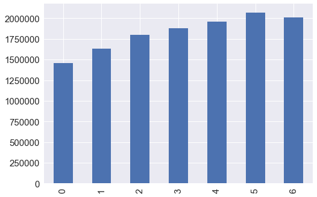


There are more rides towards the back half of the week. Here 0 is Monday and 6 is Sunday. Friday, Saturday and Sunday see more rides than the first half of the week.


```python
# Distribution of rides by hour of day?
if rerun_analysis_flag == 1:
    df_train['hour_of_day'].value_counts().sort_index().plot.bar()
```


    <matplotlib.axes._subplots.AxesSubplot at 0x1192e0f28>


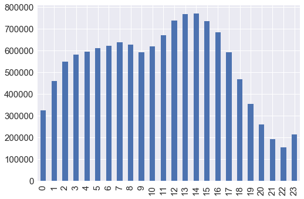


Thre is a double peaked trend to this chart showing a peak in ride demand around 7am and around 1-2pm in the afternoon across the entire data set.


```python
# Distribution of rides by month_of_year? 
if rerun_analysis_flag == 1:
    df_train['month_of_year'].value_counts().sort_index().plot.bar()
```


    <matplotlib.axes._subplots.AxesSubplot at 0x152553208>


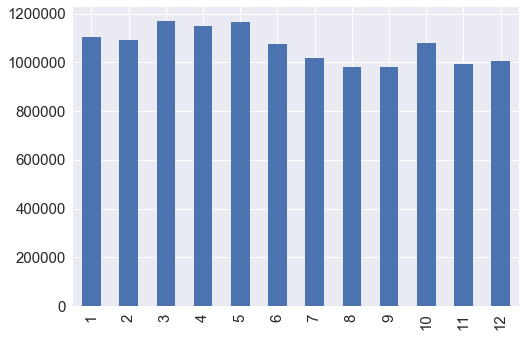


In this chart we see more rides occur in the Mar-May period than the rest of the year. Although there is a small peak in November for number of rides.


```python
# Distribution of rides by month_of_year? 
if rerun_analysis_flag == 1:
    df_train['year'].value_counts().sort_index().plot.bar()
```


    <matplotlib.axes._subplots.AxesSubplot at 0x152560d68>


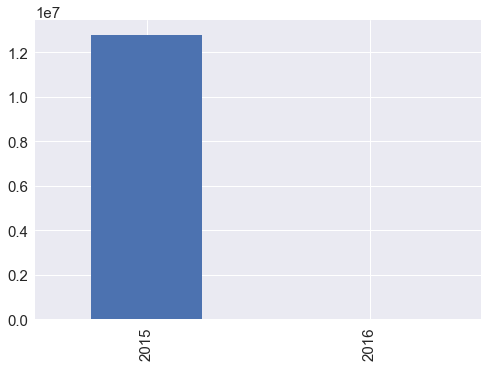


### Geospatial Journey Start and End Points
For journey information like this, on previous projects I have setup a PostGIS database and geocoded the the latitude/lonitudes into their respective statistical areas including Block Groups and Blocks. This would allow a grouping of journeys from similar statistical areas (Blocks) to other areas allowing the model to generalise well to unique properties of each journey like traffice conditions, journey routes, etc...

In lieu of doing this I will use an approximation of this method that will have a similar affect. I will group the latitude/longitude pairs into buckets of their 3rd decimal place. 

In terms of latitude/longitude this means a rectangle roughly 111 x 111 metres which can be used to identify a large agricultural field or institutional campus (https://gis.stackexchange.com/questions/8650/measuring-accuracy-of-latitude-and-longitude).


## DATA PREP STARTS HERE

#### Data Preparation Steps:
1. impute missing data
2. log scale the target var and others that are not normally distributed
3. center and scale
4. binary encode categoricals
5. Split into train and validation


### Imports, Magics and Defines


```python
# MAGICS
%matplotlib inline

# IMPORTS
import numpy as np # linear algebra
import pandas as pd # data processing, CSV file I/O (e.g. pd.read_csv)
import sklearn.preprocessing as preprocessing
import seaborn as sns
import category_encoders as ce
from sklearn.metrics import mean_squared_error
from sklearn.model_selection import train_test_split, cross_val_score
import xgboost as xgb
from sklearn.cross_validation import KFold
from sklearn.model_selection import RandomizedSearchCV
from sklearn.metrics import mean_absolute_error
import seaborn as sns
import matplotlib.pyplot as plt
import datetime
from scipy.stats import norm
from scipy import stats
import matplotlib  
import pickle 

# DEFINES
plt.style.use('ggplot')
sns.set(font_scale = 1.5)
seed = 123456
np.random.seed(seed)
```

    /home/ec2-user/src/anaconda3/lib/python3.5/site-packages/sklearn/cross_validation.py:44: DeprecationWarning: This module was deprecated in version 0.18 in favor of the model_selection module into which all the refactored classes and functions are moved. Also note that the interface of the new CV iterators are different from that of this module. This module will be removed in 0.20.
      "This module will be removed in 0.20.", DeprecationWarning)


### Data Loading


```python
df_train = pd.read_csv('data/train.csv')
```


```python
df_test = pd.read_csv('data/test.csv')
```


```python
# Keep the row ids from the test set for when we score the test data and output as csv
test_ids = df_test['row_id']
```


```python
# Flags
rerun_analysis_flag = 0
run_dprep_flag = 1
```


```python
# Drop Row ID as we won't needing this for the model
df_train = df_train.drop('row_id', axis=1)
df_test = df_test.drop('row_id', axis=1)

# Take log of duration
df_train['duration'] = np.log(df_train['duration'])
```

### Distance as the crow flys


```python
from math import sin, cos, sqrt, atan2, radians

def distLatLon(x1, y1, x2, y2):
    # approximate radius of earth in km
    R = 6373.0

    lat1 = radians(x1)
    lon1 = radians(y1)
    lat2 = radians(x2)
    lon2 = radians(y2)

    dlon = lon2 - lon1
    dlat = lat2 - lat1

    a = sin(dlat / 2)**2 + cos(lat1) * cos(lat2) * sin(dlon / 2)**2
    c = 2 * atan2(sqrt(a), sqrt(1 - a))

    distance = R * c

    return distance
```


```python
# # add distance as the crow flies TRAINING
# dist_list = []

# for i in range(0, len(df_train)):
#     dist_list.append( distLatLon(df_train['start_lng'][i], df_train['start_lat'][i], df_train['end_lng'][i], df_train['end_lat'][i]) )

# df_train = df_train.assign(dist=pd.Series(dist_list).values)
```


```python
# add distance as the crow flies  
def dist_km(row):
    d = distLatLon(row['start_lng'], row['start_lat'], row['end_lng'], row['end_lat'])
    return d
     
df_train['distance'] = df_train.apply(dist_km, axis=1) 
```


```python
df_test['distance'] = df_test.apply(dist_km, axis=1)    

```


<div>
<table border="1" class="dataframe">
  <thead>
    <tr style="text-align: right;">
      <th></th>
      <th>start_lng</th>
      <th>start_lat</th>
      <th>end_lng</th>
      <th>end_lat</th>
      <th>start_timestamp</th>
      <th>distance</th>
    </tr>
  </thead>
  <tbody>
    <tr>
      <th>0</th>
      <td>-73.993111</td>
      <td>40.724289</td>
      <td>-74.000977</td>
      <td>40.735222</td>
      <td>1422173589</td>
      <td>0.936966</td>
    </tr>
    <tr>
      <th>1</th>
      <td>-73.971924</td>
      <td>40.762749</td>
      <td>-73.965698</td>
      <td>40.771427</td>
      <td>1420567340</td>
      <td>0.742049</td>
    </tr>
    <tr>
      <th>2</th>
      <td>-73.953247</td>
      <td>40.765816</td>
      <td>-73.952843</td>
      <td>40.772453</td>
      <td>1420567343</td>
      <td>0.208955</td>
    </tr>
    <tr>
      <th>3</th>
      <td>-73.986618</td>
      <td>40.739353</td>
      <td>-73.949158</td>
      <td>40.805161</td>
      <td>1420103336</td>
      <td>4.631179</td>
    </tr>
    <tr>
      <th>4</th>
      <td>-73.968864</td>
      <td>40.757317</td>
      <td>-73.982521</td>
      <td>40.771305</td>
      <td>1420690180</td>
      <td>1.578615</td>
    </tr>
  </tbody>
</table>
</div>


### Run from here


```python
# Save Dataframes with distance and duration modified
sub_file = 'pp_train_dist_and_log_dura.csv'
df_train.to_csv(sub_file,index=False)

sub_file = 'pp_test_dist_and_log_dura.csv'
df_test.to_csv(sub_file,index=False)
```


```python
# Round Lat/Long to 3 dec places
dec_pl = 3
df_train = df_train.assign(start_lng_rnd=pd.Series(np.round(df_train['start_lng'], dec_pl) ).values)
df_train = df_train.assign(start_lat_rnd=pd.Series(np.round(df_train['start_lat'], dec_pl) ).values)
df_train = df_train.assign(end_lng_rnd=pd.Series(np.round(df_train['end_lng'], dec_pl) ).values)
df_train = df_train.assign(end_lat_rnd=pd.Series(np.round(df_train['end_lat'], dec_pl) ).values)
```


```python
df_train = df_train.drop(['start_lng', 'start_lat', 'end_lng', 'end_lat'], axis=1)
```

Now for the test set...


```python
# Round Lat/Long to 3 dec places
df_test = df_test.assign(start_lng_rnd=pd.Series(np.round(df_test['start_lng'], dec_pl) ).values)
df_test = df_test.assign(start_lat_rnd=pd.Series(np.round(df_test['start_lat'], dec_pl) ).values)
df_test = df_test.assign(end_lng_rnd=pd.Series(np.round(df_test['end_lng'], dec_pl) ).values)
df_test = df_test.assign(end_lat_rnd=pd.Series(np.round(df_test['end_lat'], dec_pl) ).values)
```


```python
df_test = df_test.drop(['start_lng', 'start_lat', 'end_lng', 'end_lat'], axis=1)
```


```python
## Apply transformations to entire dataframe
run_dprep_flag = 1
if run_dprep_flag == 1:
    # Apply to Data Frame
    df_train['day_of_week'] = df_train['start_timestamp'].apply(lambda x: datetime.datetime.fromtimestamp(x).weekday())
    df_train['hour_of_day'] = df_train['start_timestamp'].apply(lambda x: datetime.datetime.fromtimestamp(x).timetuple().tm_hour)
    df_train['day_of_year'] = df_train['start_timestamp'].apply(lambda x: datetime.datetime.fromtimestamp(x).timetuple().tm_yday)
    df_train['month_of_year'] = df_train['start_timestamp'].apply(lambda x: datetime.datetime.fromtimestamp(x).timetuple().tm_mon)
    #df_train['year'] = df_train['start_timestamp'].apply(lambda x: datetime.datetime.fromtimestamp(x).timetuple().tm_year)
    
    df_train = df_train.drop('start_timestamp', axis=1)
    now = datetime.datetime.now()
    sub_file = 'lyft_preprocessed_'  + str(now.strftime("%Y-%m-%d-%H-%M")) + '.csv'
    df_train.to_csv(sub_file,index=False)
```

Now for the test set...


```python
## Apply transformations to entire dataframe
if run_dprep_flag == 1:
    # Apply to Data Frame
    df_test['day_of_week'] = df_test['start_timestamp'].apply(lambda x: datetime.datetime.fromtimestamp(x).weekday())
    df_test['hour_of_day'] = df_test['start_timestamp'].apply(lambda x: datetime.datetime.fromtimestamp(x).timetuple().tm_hour)
    df_test['day_of_year'] = df_test['start_timestamp'].apply(lambda x: datetime.datetime.fromtimestamp(x).timetuple().tm_yday)
    df_test['month_of_year'] = df_test['start_timestamp'].apply(lambda x: datetime.datetime.fromtimestamp(x).timetuple().tm_mon)
    #df_test['year'] = df_test['start_timestamp'].apply(lambda x: datetime.datetime.fromtimestamp(x).timetuple().tm_year)
    
    df_test = df_test.drop('start_timestamp', axis=1)
    now = datetime.datetime.now()
    sub_file = 'lyft_preprocessed_testset'  + str(now.strftime("%Y-%m-%d-%H-%M")) + '.csv'
    df_test.to_csv(sub_file,index=False)
```


```python
## Min Max scale Train
scaler = preprocessing.MinMaxScaler((0,1), copy=True)

# all cols except target variable
target_var = 'duration'
mycols = df_train.drop(target_var, axis=1).columns.values.tolist()

# # Specific Columns
scaler.fit(df_train[mycols] )
df_train[mycols] = scaler.transform(df_train[mycols] )

## MIN MAX SCALE TEST SET
scaler.fit(df_test[mycols] )
df_test[mycols] = scaler.transform(df_test[mycols] )
```

### SCALE ROW WEIGHTS TO BE INVERSE TO FREQUENCY


```python
b = df_train[['hour_of_day','month_of_year']].groupby('hour_of_day').agg('count')
bb = np.round(1 // (b['month_of_year'] / b['month_of_year'].sum()) ) 
```


```python
# Make the Weights Dictionary
cc = pd.DataFrame(bb)
hours = cc.index.values
weights = [int(n) for n in cc.month_of_year.values]
weights_dict = dict(zip(hours, weights))
```


```python
# Now apply the dict to the entire dataset
df_train['weight'] = df_train['hour_of_day'].apply(lambda x: weights_dict[x])
```

### SAVE AS CSV (OLD)


```python
# Save Dataframes with distance and duration modified
# sub_file = 'pp_train_dist_log_yrMthDay_weights.csv'
# df_train.to_csv(sub_file,index=False)

# sub_file = 'pp_test_dist_log_yrMthDay_weights.csv'
# df_test.to_csv(sub_file,index=False)
```

### SAVE AS PICKLE


```python
# Pickle Data
import pickle

# Training
sub_file = 'pp_train_dist_log_yrMthDay_weights.p'
pickle.dump( df_train, open( sub_file, "wb" ) )

# Testing
sub_file = 'pp_test_dist_log_yrMthDay_weights.p'
pickle.dump( df_test, open( sub_file, "wb" ) )
```


```python
## Pickle test_ids so we dont have to load test.csv
sub_file = 'test_ids.p'
pickle.dump( test_ids, open( sub_file, "wb" ) )
```

# Load Data and Start Here!


```python
## LOAD PICKLE
df_train = pickle.load( open( 'pp_train_dist_log_yrMthDay_weights.p', "rb" ) )
df_test = pickle.load( open( 'pp_test_dist_log_yrMthDay_weights.p', "rb" ) )
test_ids = pickle.load( open( 'test_ids.p', "rb" ) )
```


```python
## CSV
# df_train = pd.read_csv('pp_train_dist_log_yrMthDay_weights.csv')
# df_test = pd.read_csv('pp_test_dist_log_yrMthDay_weights.csv')
```

### Split into train / validation sets 


```python
from sklearn.metrics import mean_squared_error
from sklearn.model_selection import train_test_split

y = df_train['duration'].values
X = df_train.drop(['duration','weight'], axis=1).as_matrix() # Drop the target duration column and the weight column to make the feature set
W = df_train['weight'].values

# Validation Set Size 20%
val_size = 0.2

X_train, X_val, y_train, y_val = train_test_split(
    X, y, test_size=val_size, random_state=seed
)
print('Done')
```

    Done


### Baseline Model

Create a linear regression model as a baseline to compare our model performance to.


```python
from sklearn import linear_model

# Create linear regression object
regr = linear_model.LinearRegression()

# Train the model using the training sets
regr.fit(X_train, y_train)

# The coefficients
print('Coefficients: \n', regr.coef_)
# The mean squared error
print("Mean absolute error: %.2f"
      % np.mean(  np.abs( np.exp(  regr.predict(X_val) ) - np.exp(y_val) ) ) )
# Explained variance score: 1 is perfect prediction
print('Variance score: %.2f' % np.exp(regr.score(X_val, y_val) ) )

```

    Coefficients: 
     [ 10.20963662  -3.17668482   0.36437528  -1.59211334  -0.38876169
       0.11306803  -0.22362831  -0.07354767   0.13381736]
    Mean absolute error: 430.10
    Variance score: 1.41


```python
var_weights = pd.DataFrame(df_train.drop(['duration','weight'], axis=1).columns.tolist(), columns=['feature'])
var_weights['coeff'] = regr.coef_
#var_weights.plot.bar()

ax = var_weights.coeff.plot.bar(rot=90)
ax.set_xticklabels(var_weights.feature)
plt.axhline(0, color='k')
```


    <matplotlib.lines.Line2D at 0x11a444860>


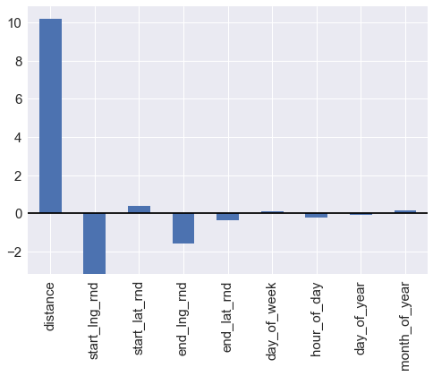


If the next model is able to beat the MAE of this linear model then we will be happy.

## Build Model

### GBM 3
Lets run the GBM with 10 iterations again, this time with a higher learning rate


```python
from sklearn import ensemble
if rerun_analysis_flag == 1:
    params = {'n_estimators': 10, 'max_depth': 4, 'min_samples_split': 2,
              'learning_rate': 0.1, 'loss': 'ls'}
    clf = ensemble.GradientBoostingRegressor(**params)

    clf.fit(X_train, y_train) # , sample_weight=X_train[:,5])
    mse = mean_absolute_error(np.exp(y_val), np.exp(clf.predict(X_val) ))
    print("MSE: %.4f" % mse)

    # compute test set deviance
    test_score = np.zeros((params['n_estimators'],), dtype=np.float64)

    for i, y_pred in enumerate(clf.staged_predict(X_val)):
        test_score[i] = clf.loss_(y_val, y_pred)
```


```python
if rerun_analysis_flag == 1:
    plt.figure(figsize=(12, 6))
    plt.subplot(1, 2, 1)
    plt.title('Deviance')
    plt.plot(np.arange(params['n_estimators']) + 1, clf.train_score_, 'b-',
             label='Training Set Deviance')
    plt.plot(np.arange(params['n_estimators']) + 1, test_score, 'r-',
             label='Validation Set Deviance')
    plt.legend(loc='upper right')
    plt.xlabel('Boosting Iterations')
    plt.ylabel('Deviance')
```


    <matplotlib.text.Text at 0x11a587588>


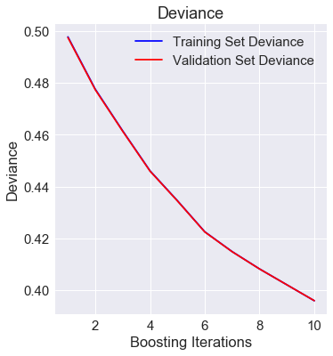


Since the train and validation set's deviance have not separated, this model could be run for more estimators. A recommended number of estimators would be around 500.


```python
column_names = pd.DataFrame(list(df_train)[1:])
```


```python
if rerun_analysis_flag == 1:
    feature_importance = clf.feature_importances_
    # make importances relative to max importance
    feature_importance = 100.0 * (feature_importance / feature_importance.max())
    sorted_idx = np.argsort(feature_importance)
    pos = np.arange(sorted_idx.shape[0]) + .5
    plt.subplot(1, 2, 2)

    column_names['idx'] = sorted_idx
    column_names.columns = ['variable', 'idx']
    cols = column_names.sort_values(by=['idx'], axis=0, ascending=True)

    plt.barh(pos, feature_importance[sorted_idx], align='center')
    #plt.yticks(pos, df_train.feature_names[sorted_idx])
    plt.yticks(pos, cols['variable'])
    plt.xlabel('Relative Importance')
    plt.title('Variable Importance')
    plt.show()
```


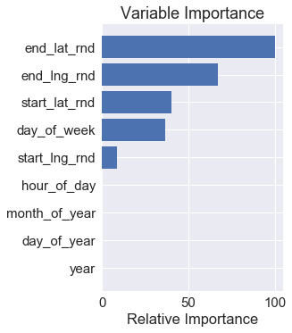


The variable importance for this model indicates that the most important variables in predicting the travel time between two locations is the start and end point latitude and longitude along with the day of the week that the trip is taken.

### XGBOOST with 5-Fold Cross Validation


```python
import xgboost as xgb
```


```python
col_names = df_train.columns[1:10].values.tolist() # duration is column 0
```


```python
def xgboost(X, y, X_sub, col_names, test_ids): #, W): # uncomment to add weights
    # Turn X_sub into a D matrix
    xg_sub = xgb.DMatrix(X_sub, feature_names=col_names)
    
    num_folds = 5
    num_estr = 100
    stopping = 10
    
    shift = 0
    ind_params = {'n_estimators':5,
                  'max_depth':5,
                  'seed':seed,
                  'objective':'reg:linear',
                  'eval_metric':'mae',
                  'silent':0}
    
    kf = KFold(X.shape[0], n_folds = num_folds)
     
    for i,(train_idx, valid_idx) in enumerate(kf):
        print('Fold %d \n' %(i+1))
        xx_train, xx_val = X[train_idx-1], X[valid_idx-1]
        yy_train, yy_val = y[train_idx-1], y[valid_idx-1]
        ww_train, ww_val = W[train_idx-1], W[valid_idx-1]

        dtrain = xgb.DMatrix(xx_train, label=yy_train, feature_names=col_names) #, weight = ww_train)
        dvalid = xgb.DMatrix(xx_val, label=yy_val, feature_names=col_names) #, weight = ww_val)
        watchlist = [(dtrain,'train'), (dvalid,'validation')]

        clf = xgb.train(ind_params, dtrain, num_estr, watchlist, early_stopping_rounds = stopping)

        score = clf.predict(dvalid, ntree_limit=clf.best_ntree_limit )

        cv_score = mean_absolute_error(np.exp(yy_val),np.exp(score))

        print('MAE %0.4f' %(cv_score))
        y_pred = np.exp(clf.predict(xg_sub, ntree_limit = clf.best_ntree_limit)) - shift

        if i>0:
            fpred = pred+y_pred
        else:
            fpred = y_pred

        pred = fpred

    print('KFold Finished ....')
    y_pred = fpred / num_folds
    
    now = datetime.datetime.now()
    sub_file = 'duration_'  + str(now.strftime("%Y-%m-%d-%H-%M")) + '.csv'

    #pd.DataFrame({'row_id':test_ids,'duration':y_pred}).to_csv(sub_file,index=False)
    out = pd.DataFrame({'row_id':test_ids,'duration':y_pred})
    out[['row_id', 'duration']].to_csv(sub_file,index=False)
    
    return y_pred, dvalid, clf
```


```python
w = (293.0379, 273.1350, 277.3356, 271.8558, 249.4153)
print('Model Submitted MAE', np.mean(w) )
```

    Model Submitted MAE 272.95592


```python
w = (225.8536, 243.9017, 252.0477, 245.0679, 267.8248 )
print('Model with distance MAE', np.mean(w) )
```

    Model with distance MAE 246.93914


```python
w = (227.8835,246.4657, 254.5008, 246.3942, 267.4517  )
print('Model with weights MAE', np.mean(w) )
```

    Model with weights MAE 248.53918


```python
w = (217.7265, 210.3023, 213.5179, 211.8090)
print('Model 100 estimators', np.mean(w) )
print( 'Improvement over submitted model' ,( 272.95592 - np.mean(w))/272.95592 )
```

    Model 100 estimators 213.338925
    Improvement over submitted model 0.218412537087


Deep learning achieved MAE 260.69


```python
xgb_1_preds, dvalid, model = xgboost(X, y, df_test, col_names, test_ids)
```

    Fold 1 
    
    [0]	train-mae:4.18599	validation-mae:4.12251
    Multiple eval metrics have been passed: 'validation-mae' will be used for early stopping.
    
    Will train until validation-mae hasn't improved in 10 rounds.
    [1]	train-mae:2.93276	validation-mae:2.87797
    [2]	train-mae:2.05713	validation-mae:2.00802
    [3]	train-mae:1.44742	validation-mae:1.40158
    [4]	train-mae:1.02937	validation-mae:0.985395
    [5]	train-mae:0.75343	validation-mae:0.714107
    [6]	train-mae:0.581211	validation-mae:0.549586
    [7]	train-mae:0.482296	validation-mae:0.456914
    [8]	train-mae:0.427109	validation-mae:0.407845
    [9]	train-mae:0.396776	validation-mae:0.382618
    [10]	train-mae:0.379426	validation-mae:0.369467
    [11]	train-mae:0.368029	validation-mae:0.360951
    [12]	train-mae:0.361687	validation-mae:0.35646
    [13]	train-mae:0.353058	validation-mae:0.349464
    [14]	train-mae:0.350475	validation-mae:0.348042
    [15]	train-mae:0.348747	validation-mae:0.346669
    [16]	train-mae:0.343844	validation-mae:0.341918
    [17]	train-mae:0.341556	validation-mae:0.339853
    [18]	train-mae:0.336828	validation-mae:0.33561
    [19]	train-mae:0.336013	validation-mae:0.335369
    [20]	train-mae:0.334551	validation-mae:0.333714
    [21]	train-mae:0.333629	validation-mae:0.33291
    [22]	train-mae:0.333046	validation-mae:0.335769
    [23]	train-mae:0.332313	validation-mae:0.335236
    [24]	train-mae:0.33078	validation-mae:0.334081
    [25]	train-mae:0.327344	validation-mae:0.330819
    [26]	train-mae:0.325446	validation-mae:0.328705
    [27]	train-mae:0.324479	validation-mae:0.327792
    [28]	train-mae:0.324208	validation-mae:0.332531
    [29]	train-mae:0.323431	validation-mae:0.331896
    [30]	train-mae:0.320263	validation-mae:0.329461
    [31]	train-mae:0.319627	validation-mae:0.328967
    [32]	train-mae:0.319108	validation-mae:0.328482
    [33]	train-mae:0.317791	validation-mae:0.32733
    [34]	train-mae:0.315458	validation-mae:0.325237
    [35]	train-mae:0.315041	validation-mae:0.325149
    [36]	train-mae:0.314485	validation-mae:0.324611
    [37]	train-mae:0.313942	validation-mae:0.324621
    [38]	train-mae:0.313536	validation-mae:0.324303
    [39]	train-mae:0.31158	validation-mae:0.322598
    [40]	train-mae:0.311041	validation-mae:0.322076
    [41]	train-mae:0.309509	validation-mae:0.320797
    [42]	train-mae:0.30904	validation-mae:0.320336
    [43]	train-mae:0.30877	validation-mae:0.32612
    [44]	train-mae:0.308592	validation-mae:0.325938
    [45]	train-mae:0.308231	validation-mae:0.325767
    [46]	train-mae:0.306451	validation-mae:0.324333
    [47]	train-mae:0.305994	validation-mae:0.323725
    [48]	train-mae:0.305456	validation-mae:0.323295
    [49]	train-mae:0.304851	validation-mae:0.322962
    [50]	train-mae:0.304375	validation-mae:0.322617
    [51]	train-mae:0.303826	validation-mae:0.321974
    [52]	train-mae:0.303636	validation-mae:0.322675
    Stopping. Best iteration:
    [42]	train-mae:0.30904	validation-mae:0.320336
    
    MAE 217.7265
    Fold 2 
    
    [0]	train-mae:4.17459	validation-mae:4.17941
    Multiple eval metrics have been passed: 'validation-mae' will be used for early stopping.
    
    Will train until validation-mae hasn't improved in 10 rounds.
    [1]	train-mae:2.9248	validation-mae:2.9279
    [2]	train-mae:2.05159	validation-mae:2.05351
    [3]	train-mae:1.44357	validation-mae:1.44652
    [4]	train-mae:1.02657	validation-mae:1.02874
    [5]	train-mae:0.751336	validation-mae:0.751919
    [6]	train-mae:0.580335	validation-mae:0.57939
    [7]	train-mae:0.478883	validation-mae:0.476015
    [8]	train-mae:0.42261	validation-mae:0.423425
    [9]	train-mae:0.392575	validation-mae:0.39338
    [10]	train-mae:0.377635	validation-mae:0.376963
    [11]	train-mae:0.367641	validation-mae:0.366107
    [12]	train-mae:0.362766	validation-mae:0.361134
    [13]	train-mae:0.358476	validation-mae:0.356345
    [14]	train-mae:0.356761	validation-mae:0.354812
    [15]	train-mae:0.350517	validation-mae:0.348555
    [16]	train-mae:0.349116	validation-mae:0.34691
    [17]	train-mae:0.343735	validation-mae:0.341517
    [18]	train-mae:0.339392	validation-mae:0.336998
    [19]	train-mae:0.338363	validation-mae:0.337025
    [20]	train-mae:0.337151	validation-mae:0.335729
    [21]	train-mae:0.335674	validation-mae:0.334508
    [22]	train-mae:0.334511	validation-mae:0.334153
    [23]	train-mae:0.333629	validation-mae:0.333256
    [24]	train-mae:0.329489	validation-mae:0.329194
    [25]	train-mae:0.328537	validation-mae:0.32815
    [26]	train-mae:0.324847	validation-mae:0.324554
    [27]	train-mae:0.32415	validation-mae:0.323935
    [28]	train-mae:0.323505	validation-mae:0.323577
    [29]	train-mae:0.323131	validation-mae:0.323318
    [30]	train-mae:0.320167	validation-mae:0.320242
    [31]	train-mae:0.319198	validation-mae:0.319287
    [32]	train-mae:0.316773	validation-mae:0.316926
    [33]	train-mae:0.316139	validation-mae:0.316269
    [34]	train-mae:0.314687	validation-mae:0.314882
    [35]	train-mae:0.314198	validation-mae:0.314738
    [36]	train-mae:0.313439	validation-mae:0.313998
    [37]	train-mae:0.312702	validation-mae:0.313379
    [38]	train-mae:0.312247	validation-mae:0.312977
    [39]	train-mae:0.311879	validation-mae:0.312852
    [40]	train-mae:0.310945	validation-mae:0.311869
    [41]	train-mae:0.309961	validation-mae:0.310938
    [42]	train-mae:0.309459	validation-mae:0.310484
    [43]	train-mae:0.307988	validation-mae:0.308988
    [44]	train-mae:0.30744	validation-mae:0.308377
    [45]	train-mae:0.306136	validation-mae:0.307138
    [46]	train-mae:0.30505	validation-mae:0.306091
    [47]	train-mae:0.304771	validation-mae:0.305886
    [48]	train-mae:0.304561	validation-mae:0.305859
    [49]	train-mae:0.30365	validation-mae:0.305784
    [50]	train-mae:0.303357	validation-mae:0.305583
    [51]	train-mae:0.302533	validation-mae:0.304756
    [52]	train-mae:0.302326	validation-mae:0.304525
    [53]	train-mae:0.301732	validation-mae:0.303928
    [54]	train-mae:0.300475	validation-mae:0.302562
    [55]	train-mae:0.299983	validation-mae:0.302043
    [56]	train-mae:0.299456	validation-mae:0.301419
    [57]	train-mae:0.299027	validation-mae:0.300987
    [58]	train-mae:0.298783	validation-mae:0.300768
    [59]	train-mae:0.298397	validation-mae:0.300474
    [60]	train-mae:0.298248	validation-mae:0.300377
    [61]	train-mae:0.298097	validation-mae:0.300378
    [62]	train-mae:0.297328	validation-mae:0.299687
    [63]	train-mae:0.29541	validation-mae:0.297762
    [64]	train-mae:0.294696	validation-mae:0.29696
    [65]	train-mae:0.293893	validation-mae:0.296045
    [66]	train-mae:0.29344	validation-mae:0.29559
    [67]	train-mae:0.293176	validation-mae:0.295302
    [68]	train-mae:0.293023	validation-mae:0.295187
    [69]	train-mae:0.292797	validation-mae:0.294942
    [70]	train-mae:0.292522	validation-mae:0.294692
    [71]	train-mae:0.292374	validation-mae:0.294533
    [72]	train-mae:0.292022	validation-mae:0.294125
    [73]	train-mae:0.29094	validation-mae:0.293006
    [74]	train-mae:0.290812	validation-mae:0.292898
    [75]	train-mae:0.290715	validation-mae:0.292822
    [76]	train-mae:0.290471	validation-mae:0.292836
    [77]	train-mae:0.290248	validation-mae:0.292632
    [78]	train-mae:0.289946	validation-mae:0.292443
    [79]	train-mae:0.289581	validation-mae:0.29218
    [80]	train-mae:0.289322	validation-mae:0.291966
    [81]	train-mae:0.289233	validation-mae:0.291938
    [82]	train-mae:0.28883	validation-mae:0.291934
    [83]	train-mae:0.288558	validation-mae:0.292087
    [84]	train-mae:0.288444	validation-mae:0.292017
    [85]	train-mae:0.288264	validation-mae:0.291835
    [86]	train-mae:0.287906	validation-mae:0.291499
    [87]	train-mae:0.287023	validation-mae:0.290477
    [88]	train-mae:0.286866	validation-mae:0.290348
    [89]	train-mae:0.286288	validation-mae:0.289805
    [90]	train-mae:0.285816	validation-mae:0.289354
    [91]	train-mae:0.285402	validation-mae:0.288924
    [92]	train-mae:0.284728	validation-mae:0.288262
    [93]	train-mae:0.284608	validation-mae:0.288143
    [94]	train-mae:0.283861	validation-mae:0.287449
    [95]	train-mae:0.283691	validation-mae:0.287233
    [96]	train-mae:0.283427	validation-mae:0.286996
    [97]	train-mae:0.282863	validation-mae:0.286398
    [98]	train-mae:0.282727	validation-mae:0.286367
    [99]	train-mae:0.282548	validation-mae:0.286213
    MAE 210.3023
    Fold 3 
    
    [0]	train-mae:4.17287	validation-mae:4.1854
    Multiple eval metrics have been passed: 'validation-mae' will be used for early stopping.
    
    Will train until validation-mae hasn't improved in 10 rounds.
    [1]	train-mae:2.92353	validation-mae:2.9314
    [2]	train-mae:2.05067	validation-mae:2.05608
    [3]	train-mae:1.44285	validation-mae:1.44633
    [4]	train-mae:1.02574	validation-mae:1.02775
    [5]	train-mae:0.750647	validation-mae:0.752256
    [6]	train-mae:0.57974	validation-mae:0.580789
    [7]	train-mae:0.4806	validation-mae:0.481841
    [8]	train-mae:0.42492	validation-mae:0.427559
    [9]	train-mae:0.395023	validation-mae:0.397188
    [10]	train-mae:0.375678	validation-mae:0.377841
    [11]	train-mae:0.366019	validation-mae:0.368504
    [12]	train-mae:0.360062	validation-mae:0.362232
    [13]	train-mae:0.356877	validation-mae:0.359243
    [14]	train-mae:0.355106	validation-mae:0.357345
    [15]	train-mae:0.350324	validation-mae:0.352314
    [16]	train-mae:0.34567	validation-mae:0.347575
    [17]	train-mae:0.341802	validation-mae:0.343746
    [18]	train-mae:0.341022	validation-mae:0.342895
    [19]	train-mae:0.339449	validation-mae:0.342073
    [20]	train-mae:0.338323	validation-mae:0.341228
    [21]	train-mae:0.336498	validation-mae:0.339041
    [22]	train-mae:0.332774	validation-mae:0.335254
    [23]	train-mae:0.331833	validation-mae:0.334674
    [24]	train-mae:0.328642	validation-mae:0.331513
    [25]	train-mae:0.325804	validation-mae:0.328839
    [26]	train-mae:0.324411	validation-mae:0.327313
    [27]	train-mae:0.322072	validation-mae:0.324946
    [28]	train-mae:0.320923	validation-mae:0.323948
    [29]	train-mae:0.320007	validation-mae:0.323291
    [30]	train-mae:0.319422	validation-mae:0.322667
    [31]	train-mae:0.318945	validation-mae:0.322222
    [32]	train-mae:0.318523	validation-mae:0.321805
    [33]	train-mae:0.317164	validation-mae:0.320388
    [34]	train-mae:0.31438	validation-mae:0.317545
    [35]	train-mae:0.313256	validation-mae:0.316559
    [36]	train-mae:0.312248	validation-mae:0.315428
    [37]	train-mae:0.311307	validation-mae:0.314551
    [38]	train-mae:0.310698	validation-mae:0.313933
    [39]	train-mae:0.308579	validation-mae:0.311922
    [40]	train-mae:0.308209	validation-mae:0.31189
    [41]	train-mae:0.30764	validation-mae:0.311446
    [42]	train-mae:0.306583	validation-mae:0.310145
    [43]	train-mae:0.306357	validation-mae:0.309885
    [44]	train-mae:0.305581	validation-mae:0.309113
    [45]	train-mae:0.303816	validation-mae:0.307397
    [46]	train-mae:0.302451	validation-mae:0.306223
    [47]	train-mae:0.301149	validation-mae:0.30508
    [48]	train-mae:0.300095	validation-mae:0.304182
    [49]	train-mae:0.299778	validation-mae:0.303838
    [50]	train-mae:0.299591	validation-mae:0.303707
    [51]	train-mae:0.299215	validation-mae:0.303325
    [52]	train-mae:0.299036	validation-mae:0.303138
    [53]	train-mae:0.298615	validation-mae:0.302513
    [54]	train-mae:0.298357	validation-mae:0.302248
    [55]	train-mae:0.298111	validation-mae:0.302246
    [56]	train-mae:0.297197	validation-mae:0.301342
    [57]	train-mae:0.295313	validation-mae:0.299489
    [58]	train-mae:0.295082	validation-mae:0.2993
    [59]	train-mae:0.294791	validation-mae:0.298958
    [60]	train-mae:0.294403	validation-mae:0.298592
    [61]	train-mae:0.294262	validation-mae:0.298461
    [62]	train-mae:0.294031	validation-mae:0.298248
    [63]	train-mae:0.293862	validation-mae:0.298067
    [64]	train-mae:0.293726	validation-mae:0.297901
    [65]	train-mae:0.292601	validation-mae:0.296781
    [66]	train-mae:0.292108	validation-mae:0.296309
    [67]	train-mae:0.291975	validation-mae:0.296264
    [68]	train-mae:0.291332	validation-mae:0.295668
    [69]	train-mae:0.291199	validation-mae:0.295644
    [70]	train-mae:0.290736	validation-mae:0.295474
    [71]	train-mae:0.290437	validation-mae:0.295211
    [72]	train-mae:0.290166	validation-mae:0.294962
    [73]	train-mae:0.289255	validation-mae:0.294055
    [74]	train-mae:0.288407	validation-mae:0.29321
    [75]	train-mae:0.288244	validation-mae:0.293052
    [76]	train-mae:0.287122	validation-mae:0.292066
    [77]	train-mae:0.286912	validation-mae:0.291859
    [78]	train-mae:0.286776	validation-mae:0.291707
    [79]	train-mae:0.28616	validation-mae:0.291108
    [80]	train-mae:0.286017	validation-mae:0.290979
    [81]	train-mae:0.285884	validation-mae:0.29087
    [82]	train-mae:0.285751	validation-mae:0.290784
    [83]	train-mae:0.28539	validation-mae:0.290448
    [84]	train-mae:0.285295	validation-mae:0.290372
    [85]	train-mae:0.285141	validation-mae:0.29032
    [86]	train-mae:0.28504	validation-mae:0.290322
    [87]	train-mae:0.284705	validation-mae:0.289992
    [88]	train-mae:0.284561	validation-mae:0.289882
    [89]	train-mae:0.28449	validation-mae:0.289826
    [90]	train-mae:0.284347	validation-mae:0.28958
    [91]	train-mae:0.284173	validation-mae:0.289319
    [92]	train-mae:0.283838	validation-mae:0.289038
    [93]	train-mae:0.283684	validation-mae:0.288917
    [94]	train-mae:0.282679	validation-mae:0.287884
    [95]	train-mae:0.28254	validation-mae:0.287777
    [96]	train-mae:0.282396	validation-mae:0.287673
    [97]	train-mae:0.282089	validation-mae:0.287372
    [98]	train-mae:0.281618	validation-mae:0.28685
    [99]	train-mae:0.280872	validation-mae:0.286122
    MAE 213.5179
    Fold 4 
    
    [0]	train-mae:4.17362	validation-mae:4.17995
    Multiple eval metrics have been passed: 'validation-mae' will be used for early stopping.
    
    Will train until validation-mae hasn't improved in 10 rounds.
    [1]	train-mae:2.92403	validation-mae:2.92556
    [2]	train-mae:2.05095	validation-mae:2.04957
    [3]	train-mae:1.44301	validation-mae:1.43967
    [4]	train-mae:1.02594	validation-mae:1.02054
    [5]	train-mae:0.750397	validation-mae:0.744936
    [6]	train-mae:0.579428	validation-mae:0.57387
    [7]	train-mae:0.480574	validation-mae:0.474987
    [8]	train-mae:0.4263	validation-mae:0.422269
    [9]	train-mae:0.396293	validation-mae:0.392755
    [10]	train-mae:0.380872	validation-mae:0.378984
    [11]	train-mae:0.366338	validation-mae:0.365016
    [12]	train-mae:0.360216	validation-mae:0.359721
    [13]	train-mae:0.353882	validation-mae:0.353678
    [14]	train-mae:0.351538	validation-mae:0.352215
    [15]	train-mae:0.346056	validation-mae:0.346734
    [16]	train-mae:0.343688	validation-mae:0.344996
    [17]	train-mae:0.342584	validation-mae:0.344051
    [18]	train-mae:0.339893	validation-mae:0.341257
    [19]	train-mae:0.334967	validation-mae:0.336342
    [20]	train-mae:0.332037	validation-mae:0.333472
    [21]	train-mae:0.330981	validation-mae:0.33257
    [22]	train-mae:0.327534	validation-mae:0.329084
    [23]	train-mae:0.326763	validation-mae:0.328272
    [24]	train-mae:0.326124	validation-mae:0.327894
    [25]	train-mae:0.325237	validation-mae:0.327455
    [26]	train-mae:0.323829	validation-mae:0.326046
    [27]	train-mae:0.319545	validation-mae:0.321815
    [28]	train-mae:0.317055	validation-mae:0.319479
    [29]	train-mae:0.316126	validation-mae:0.318567
    [30]	train-mae:0.315251	validation-mae:0.317988
    [31]	train-mae:0.314527	validation-mae:0.317277
    [32]	train-mae:0.313915	validation-mae:0.31664
    [33]	train-mae:0.312082	validation-mae:0.314935
    [34]	train-mae:0.311123	validation-mae:0.313917
    [35]	train-mae:0.310314	validation-mae:0.313373
    [36]	train-mae:0.309591	validation-mae:0.312589
    [37]	train-mae:0.307827	validation-mae:0.310957
    [38]	train-mae:0.307044	validation-mae:0.310226
    [39]	train-mae:0.306107	validation-mae:0.309273
    [40]	train-mae:0.305771	validation-mae:0.309227
    [41]	train-mae:0.305041	validation-mae:0.308589
    [42]	train-mae:0.303921	validation-mae:0.307561
    [43]	train-mae:0.303494	validation-mae:0.307098
    [44]	train-mae:0.301945	validation-mae:0.305629
    [45]	train-mae:0.301631	validation-mae:0.305283
    [46]	train-mae:0.301445	validation-mae:0.305129
    [47]	train-mae:0.30115	validation-mae:0.304784
    [48]	train-mae:0.300732	validation-mae:0.304556
    [49]	train-mae:0.300357	validation-mae:0.304131
    [50]	train-mae:0.3002	validation-mae:0.30409
    [51]	train-mae:0.29875	validation-mae:0.302703
    [52]	train-mae:0.298372	validation-mae:0.302365
    [53]	train-mae:0.298122	validation-mae:0.302105
    [54]	train-mae:0.297871	validation-mae:0.301877
    [55]	train-mae:0.297333	validation-mae:0.301356
    [56]	train-mae:0.296794	validation-mae:0.30109
    [57]	train-mae:0.29615	validation-mae:0.300436
    [58]	train-mae:0.294327	validation-mae:0.298609
    [59]	train-mae:0.293998	validation-mae:0.298288
    [60]	train-mae:0.293342	validation-mae:0.297609
    [61]	train-mae:0.293234	validation-mae:0.297518
    [62]	train-mae:0.293068	validation-mae:0.297403
    [63]	train-mae:0.292843	validation-mae:0.297161
    [64]	train-mae:0.292369	validation-mae:0.296726
    [65]	train-mae:0.292228	validation-mae:0.296656
    [66]	train-mae:0.29169	validation-mae:0.295742
    [67]	train-mae:0.290733	validation-mae:0.29484
    [68]	train-mae:0.290501	validation-mae:0.29461
    [69]	train-mae:0.290379	validation-mae:0.29447
    [70]	train-mae:0.289409	validation-mae:0.293517
    [71]	train-mae:0.289189	validation-mae:0.293311
    [72]	train-mae:0.287837	validation-mae:0.29199
    [73]	train-mae:0.287359	validation-mae:0.291555
    [74]	train-mae:0.287215	validation-mae:0.291421
    [75]	train-mae:0.287	validation-mae:0.29121
    [76]	train-mae:0.286785	validation-mae:0.290999
    [77]	train-mae:0.286638	validation-mae:0.290898
    [78]	train-mae:0.286486	validation-mae:0.290766
    [79]	train-mae:0.286236	validation-mae:0.290538
    [80]	train-mae:0.285937	validation-mae:0.290304
    [81]	train-mae:0.285738	validation-mae:0.290268
    [82]	train-mae:0.285279	validation-mae:0.289896
    [83]	train-mae:0.285161	validation-mae:0.28976
    [84]	train-mae:0.284685	validation-mae:0.289336
    [85]	train-mae:0.283998	validation-mae:0.288698
    [86]	train-mae:0.283837	validation-mae:0.288503
    [87]	train-mae:0.283636	validation-mae:0.28833
    [88]	train-mae:0.283401	validation-mae:0.288145
    [89]	train-mae:0.283209	validation-mae:0.287947
    [90]	train-mae:0.283054	validation-mae:0.287797
    [91]	train-mae:0.28296	validation-mae:0.28768
    [92]	train-mae:0.282447	validation-mae:0.28719
    [93]	train-mae:0.282307	validation-mae:0.287145
    [94]	train-mae:0.282047	validation-mae:0.286913
    [95]	train-mae:0.281806	validation-mae:0.286693
    [96]	train-mae:0.281535	validation-mae:0.286468
    [97]	train-mae:0.28141	validation-mae:0.286335
    [98]	train-mae:0.281291	validation-mae:0.286315
    [99]	train-mae:0.28122	validation-mae:0.286331
    MAE 211.8090
    Fold 5 
    
    [0]	train-mae:4.17033	validation-mae:4.21069
    Multiple eval metrics have been passed: 'validation-mae' will be used for early stopping.
    
    Will train until validation-mae hasn't improved in 10 rounds.
    [1]	train-mae:2.92171	validation-mae:2.96549
    [2]	train-mae:2.04934	validation-mae:2.09518
    [3]	train-mae:1.4418	validation-mae:1.48934
    [4]	train-mae:1.02477	validation-mae:1.07224
    [5]	train-mae:0.748513	validation-mae:0.795189
    [6]	train-mae:0.575307	validation-mae:0.620268
    [7]	train-mae:0.474768	validation-mae:0.516337
    [8]	train-mae:0.417744	validation-mae:0.455922
    [9]	train-mae:0.386513	validation-mae:0.421028
    [10]	train-mae:0.369227	validation-mae:0.400939
    [11]	train-mae:0.360677	validation-mae:0.390743
    [12]	train-mae:0.354622	validation-mae:0.382571
    [13]	train-mae:0.351019	validation-mae:0.37739
    [14]	train-mae:0.346052	validation-mae:0.371835
    [15]	train-mae:0.344783	validation-mae:0.369668
    [16]	train-mae:0.343001	validation-mae:0.366007
    [17]	train-mae:0.339469	validation-mae:0.362719
    [18]	train-mae:0.335846	validation-mae:0.358987
    [19]	train-mae:0.334262	validation-mae:0.356948
    [20]	train-mae:0.330747	validation-mae:0.353578
    [21]	train-mae:0.32998	validation-mae:0.350209
    [22]	train-mae:0.329157	validation-mae:0.349846
    [23]	train-mae:0.326892	validation-mae:0.347798
    [24]	train-mae:0.32602	validation-mae:0.347
    [25]	train-mae:0.325282	validation-mae:0.345674
    [26]	train-mae:0.32448	validation-mae:0.344937
    [27]	train-mae:0.323379	validation-mae:0.344151
    [28]	train-mae:0.321594	validation-mae:0.3429
    [29]	train-mae:0.319458	validation-mae:0.340778
    [30]	train-mae:0.318156	validation-mae:0.339562
    [31]	train-mae:0.316775	validation-mae:0.338227
    [32]	train-mae:0.315886	validation-mae:0.337339
    [33]	train-mae:0.313874	validation-mae:0.335294
    [34]	train-mae:0.312028	validation-mae:0.333589
    [35]	train-mae:0.30895	validation-mae:0.330388
    [36]	train-mae:0.307961	validation-mae:0.329416
    [37]	train-mae:0.307296	validation-mae:0.328648
    [38]	train-mae:0.306198	validation-mae:0.327702
    [39]	train-mae:0.305351	validation-mae:0.327232
    [40]	train-mae:0.304896	validation-mae:0.327573
    [41]	train-mae:0.303962	validation-mae:0.326718
    [42]	train-mae:0.303606	validation-mae:0.326246
    [43]	train-mae:0.303265	validation-mae:0.326317
    [44]	train-mae:0.302765	validation-mae:0.325508
    [45]	train-mae:0.30188	validation-mae:0.324646
    [46]	train-mae:0.301626	validation-mae:0.324628
    [47]	train-mae:0.301227	validation-mae:0.324393
    [48]	train-mae:0.300508	validation-mae:0.323696
    [49]	train-mae:0.300266	validation-mae:0.322826
    [50]	train-mae:0.299997	validation-mae:0.322585
    [51]	train-mae:0.29772	validation-mae:0.320063
    [52]	train-mae:0.296606	validation-mae:0.318818
    [53]	train-mae:0.296085	validation-mae:0.318425
    [54]	train-mae:0.294783	validation-mae:0.31712
    [55]	train-mae:0.294537	validation-mae:0.316913
    [56]	train-mae:0.294297	validation-mae:0.316792
    [57]	train-mae:0.294144	validation-mae:0.316704
    [58]	train-mae:0.293946	validation-mae:0.316515
    [59]	train-mae:0.293639	validation-mae:0.316251
    [60]	train-mae:0.293486	validation-mae:0.316136
    [61]	train-mae:0.29328	validation-mae:0.315952
    [62]	train-mae:0.292599	validation-mae:0.315249
    [63]	train-mae:0.292153	validation-mae:0.314901
    [64]	train-mae:0.291762	validation-mae:0.314522
    [65]	train-mae:0.290274	validation-mae:0.312906
    [66]	train-mae:0.289874	validation-mae:0.312535
    [67]	train-mae:0.289685	validation-mae:0.312375
    [68]	train-mae:0.289217	validation-mae:0.311918
    [69]	train-mae:0.288915	validation-mae:0.311701
    [70]	train-mae:0.288534	validation-mae:0.311263
    [71]	train-mae:0.287391	validation-mae:0.310023
    [72]	train-mae:0.287029	validation-mae:0.30979
    [73]	train-mae:0.286866	validation-mae:0.309664
    [74]	train-mae:0.286165	validation-mae:0.308858
    [75]	train-mae:0.285284	validation-mae:0.307855
    [76]	train-mae:0.284957	validation-mae:0.307847
    [77]	train-mae:0.284846	validation-mae:0.307766
    [78]	train-mae:0.284187	validation-mae:0.307036
    [79]	train-mae:0.284062	validation-mae:0.307122
    [80]	train-mae:0.283379	validation-mae:0.306255


### XGBOOST Variable Importance


```python
# fig, ax = plt.subplots(figsize=(15, 15)) # adjust plot size
xgb.plot_importance(model)
```


    <matplotlib.axes._subplots.AxesSubplot at 0x7fc9bfff0278>


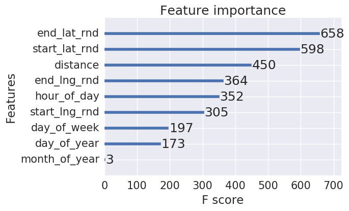


### Weight conculsions
When adding hour_of_day weights into the model the hour_of_day became more important in predicting the duration.

This variable importance plot from XGBOOST reinforces the variable importances seen early for the gradient boosted trees. Again the start/end latitude and longitude and the hour of the day were the most important variables in predicting the duration seconds.

This leads us to think that the other variables (day_of_week, day_of_year, month_of_year) do not contain as much relevant information or their features require a different type of engineering, for instance one-hot or binary encoding. 

## Conculsion

* The XGboost model had the lowest MAE and was used to create the submission file duration.csv
* The most important variables in predicting the duration seconds were start/end latitude and longitude and the hour of the day
* This makes sense from a practical perspective as the duration of the Lyft ride will be dependent on the distance from point A to B, the geographic and traffic conditions of the start and end points and the hour of the day that you take the ride

## Real Time Considerations
For a real time implementation in a mobile app the computational overhead would not be too large. It would only require the weights from the trained model and the feature engineering pipeline, both of which are quite small in this case. The feature engineering just consists of a rounding process and some datetime operations.
Libraries to implement this sort of model on iOS and Android currently exist and there is further opportunity to use a deep learning approach as Tensorflow Lite just became available at the time of writing, which works on iOS and Android.

## Improvements 
This model could be improved through a number of tweaks to the dataset and the model itself. Including:  
1. One-hot encode or Binary encode the ordinal variables like year, day_of_week, month_of_year and day_of_year
2. Run a random search to find the best hyper parameters
3. Run the model with more folds and more estimators for XGBoost
3. Perform further feature engineering including:  
    a. Distance between start and end point  
    b. Geocode the start/end points to a statistical area    
4. Use a custom loss/cost function if necessary. In this case mae(np.exp())

# Bonus Round - Deep Learning


```python
from keras.models import Sequential
from keras.callbacks import EarlyStopping, ModelCheckpoint
from keras.layers import Dense, Activation, Dropout
from keras import optimizers
print('Done')
```

    Using TensorFlow backend.


    Done


```python
## Roll your own metric
import keras.backend as K

def mae(y_true, y_pred):  
    return K.mean( K.abs( K.exp(y_true) - K.exp(y_pred) ) )
```


```python
epochs = 12
learn_rate = 0.01
batch_size= 256
dropout = 0.2
init_mean = 0.0
init_stdev = 0.05
```


```python
m = Sequential()
m.add(Dense(512, activation='relu', input_shape=(X.shape[1],)))
m.add(Dropout(dropout))
m.add(Dense(256, activation='relu'))
m.add(Dropout(dropout))
m.add(Dense(128, activation='relu'))
m.add(Dropout(dropout))
m.add(Dense(1, activation=None))  # linear activation for regression

m.compile(
    optimizer=optimizers.Adam(lr=learn_rate),
    loss='mean_absolute_error',
    metrics=[mae]
)
```


```python
print('Starting training....')

m.fit(
    # Feature matrix
    X_train,
    # Target class one-hot-encoded
    y_train,
    # Iterations to be run if not stopped by EarlyStopping
    nb_epoch=epochs,
    callbacks=[
        # Stop iterations when validation loss has not improved
        EarlyStopping(monitor='val_loss', patience=25),
        # Nice for keeping the last model before overfitting occurs
        ModelCheckpoint(
            'best.model',
            monitor='val_loss',
            save_best_only=True,
            verbose=1
        )
    ],
    #verbose=2,
    validation_split=0.1,
    batch_size=batch_size
)
print('Done')
```

    Starting training....
    Train on 9292114 samples, validate on 1032458 samples
    Epoch 1/12
    9291008/9292114 [============================>.] - ETA: 0s - loss: 0.3959 - mae: 295.0887Epoch 00000: val_loss improved from inf to 0.33599, saving model to best.model
    9292114/9292114 [==============================] - 217s - loss: 0.3959 - mae: 295.0849 - val_loss: 0.3360 - val_mae: 243.5257
    Epoch 2/12
    9290496/9292114 [============================>.] - ETA: 0s - loss: 0.3589 - mae: 268.4736Epoch 00001: val_loss improved from 0.33599 to 0.33379, saving model to best.model
    9292114/9292114 [==============================] - 216s - loss: 0.3589 - mae: 268.4721 - val_loss: 0.3338 - val_mae: 246.2728
    Epoch 3/12
    9291008/9292114 [============================>.] - ETA: 0s - loss: 0.3550 - mae: 266.3498Epoch 00002: val_loss did not improve
    9292114/9292114 [==============================] - 216s - loss: 0.3550 - mae: 266.3479 - val_loss: 0.3420 - val_mae: 245.5534
    Epoch 4/12
    9290752/9292114 [============================>.] - ETA: 0s - loss: 0.3523 - mae: 265.0234Epoch 00003: val_loss improved from 0.33379 to 0.33016, saving model to best.model
    9292114/9292114 [==============================] - 217s - loss: 0.3523 - mae: 265.0215 - val_loss: 0.3302 - val_mae: 236.2215
    Epoch 5/12
    9291264/9292114 [============================>.] - ETA: 0s - loss: 0.3515 - mae: 264.9288Epoch 00004: val_loss did not improve
    9292114/9292114 [==============================] - 216s - loss: 0.3515 - mae: 264.9301 - val_loss: 0.3454 - val_mae: 255.0484
    Epoch 6/12
    9290752/9292114 [============================>.] - ETA: 0s - loss: 0.3528 - mae: 267.0910Epoch 00005: val_loss improved from 0.33016 to 0.32039, saving model to best.model
    9292114/9292114 [==============================] - 216s - loss: 0.3528 - mae: 267.0881 - val_loss: 0.3204 - val_mae: 240.2277
    Epoch 7/12
    9290496/9292114 [============================>.] - ETA: 0s - loss: 0.3528 - mae: 267.7031Epoch 00006: val_loss improved from 0.32039 to 0.31252, saving model to best.model
    9292114/9292114 [==============================] - 216s - loss: 0.3528 - mae: 267.7059 - val_loss: 0.3125 - val_mae: 229.3041
    Epoch 8/12
    9291776/9292114 [============================>.] - ETA: 0s - loss: 0.3523 - mae: 268.0252Epoch 00007: val_loss did not improve
    9292114/9292114 [==============================] - 216s - loss: 0.3523 - mae: 268.0261 - val_loss: 0.3473 - val_mae: 254.9866
    Epoch 9/12
    9290752/9292114 [============================>.] - ETA: 0s - loss: 0.3498 - mae: 266.5626Epoch 00008: val_loss did not improve
    9292114/9292114 [==============================] - 216s - loss: 0.3498 - mae: 266.5650 - val_loss: 0.3138 - val_mae: 239.0614
    Epoch 10/12
    9292032/9292114 [============================>.] - ETA: 0s - loss: 0.3505 - mae: 267.3707Epoch 00009: val_loss did not improve
    9292114/9292114 [==============================] - 216s - loss: 0.3505 - mae: 267.3704 - val_loss: 0.3156 - val_mae: 240.7343
    Epoch 11/12
    9291776/9292114 [============================>.] - ETA: 0s - loss: 0.3504 - mae: 267.3179Epoch 00010: val_loss improved from 0.31252 to 0.31193, saving model to best.model
    9292114/9292114 [==============================] - 216s - loss: 0.3504 - mae: 267.3173 - val_loss: 0.3119 - val_mae: 230.4061
    Epoch 12/12
    9291520/9292114 [============================>.] - ETA: 0s - loss: 0.3507 - mae: 267.6891Epoch 00011: val_loss did not improve
    9292114/9292114 [==============================] - 217s - loss: 0.3507 - mae: 267.6871 - val_loss: 0.3191 - val_mae: 244.4951
    Done


```python
## Check Error
m.load_weights("best.model")

mae = mean_absolute_error( np.exp(y_val), np.exp( m.predict(X_val) ))
print('MAE', mae)
```

    MAE 230.545337491


### Deep Learning Conclusion
The deep learning network was not any better than K-folds cross validation with gradient boosted trees and it took longer to train even using a GPU.
MAE DL=230.55 vs XGB=213.34

This problem is probably quite linear so using a neural network may not have been an advantage (they offer best improvement on non-linear problems).


